# 📋 Athenify Loyihasi — To'liq Tushuntirilishi

## 📁 Loyiha Tuzilishi (Project Structure)

```
1302/
├── index.html              ← Asosiy HTML fayl (React ilova shu yerga mount bo'ladi)
├── package.json            ← Kutubxonalar ro'yxati
├── vite.config.ts          ← Vite bundler sozlamalari
├── src/
│   ├── main.tsx            ← Kirish nuqtasi (Entry Point)
│   ├── App.tsx             ← Routing (yo'naltirishlar)
│   ├── index.css           ← Barcha stillar (CSS)
│   ├── data/
│   │   └── mockData.ts     ← Soxta ma'lumotlar (fake data)
│   ├── components/
│   │   └── layout/
│   │       ├── AppLayout.tsx   ← Asosiy sahifa skeleti
│   │       ├── Sidebar.tsx     ← Chap panel (navigatsiya)
│   │       └── Header.tsx      ← Yuqori panel
│   └── pages/
│       ├── LoginPage.tsx       ← Kirish sahifasi
│       ├── DashboardPage.tsx   ← Bosh sahifa
│       ├── SessionsPage.tsx    ← Sessiyalar
│       ├── CalendarPage.tsx    ← Kalendar
│       ├── TermPage.tsx        ← Semestr
│       ├── CoursesPage.tsx     ← Kurslar
│       ├── DataRoomPage.tsx    ← Ma'lumotlar xonasi
│       ├── AchievementsPage.tsx← Yutuqlar
│       ├── TermConfigPage.tsx  ← Semestr sozlamalari
│       └── SettingsPage.tsx    ← Umumiy sozlamalar
```

---

## 🔄 Ilova Oqimi (Application Flow)

```mermaid
graph TD
    A["main.tsx — Ilova boshlanadi"] --> B["App.tsx — Router"]
    B --> C{"/login yo'li?"}
    C -->|Ha| D["LoginPage — Kirish formasi"]
    C -->|Yo'q| E["AppLayout — Sidebar + Header + Content"]
    D -->|Login bosilsa| E
    E --> F["Outlet — ichki sahifalar"]
    F --> G["DashboardPage"]
    F --> H["SessionsPage"]
    F --> I["CalendarPage"]
    F --> J["TermPage"]
    F --> K["CoursesPage"]
    F --> L["DataRoomPage"]
    F --> M["AchievementsPage"]
    F --> N["TermConfigPage"]
    F --> O["SettingsPage"]
```



### Qisqacha oqim:
1. **Foydalanuvchi** saytga kiradi → `LoginPage` ko'rinadi
2. Login tugmasini bosadi → `/dashboard` ga yo'naltiriladi
3. `AppLayout` yuklanadi — bu **Sidebar** (chap) + **Header** (yuqori) + **Ichki sahifa** strukturasi
4. Sidebar orqali har bir sahifaga o'tish mumkin

---

## 🧩 Layout Komponentlari

### 1. `main.tsx` — Kirish nuqtasi
**Fayl:** [main.tsx](file:///Users/kamronbekodil/Desktop/Programming/1302/src/main.tsx)

| Narsa | Tushuntirish |
|-------|-------------|
| `createRoot()` | React ilovani DOM ga mount qiladi |
| `<StrictMode>` | Development uchun qo'shimcha tekshiruvlar |
| `<App />` | Asosiy ilova komponenti |
| `import './index.css'` | Global CSS yuklaydi |

**O'chirish xavfi:** ❌ Bu faylni O'chirish MUMKIN EMAS — ilova boshlanmaydi.

---

### 2. `App.tsx` — Router (Yo'naltirishlar)
**Fayl:** [App.tsx](file:///Users/kamronbekodil/Desktop/Programming/1302/src/App.tsx)

| Route | Sahifa | Tavsif |
|-------|--------|--------|
| `/login` | `LoginPage` | Alohida sahifa (Sidebar/Header yo'q) |
| `/` | `AppLayout` | Layout wrapper — Sidebar + Header |
| `/dashboard` | `DashboardPage` | Bosh sahifa |
| `/sessions` | `SessionsPage` | Sessiyalar ro'yxati |
| `/calendar` | `CalendarPage` | Kalendar ko'rinishi |
| `/term` | `TermPage` | Semestr statistikasi |
| `/courses` | `CoursesPage` | Kurslar ro'yxati |
| `/data-room` | `DataRoomPage` | Ma'lumotlar matritsasi |
| `/achievements` | `AchievementsPage` | Yutuqlar/medallar |
| `/term-config` | `TermConfigPage` | Semestr sozlamalari |
| `/settings` | `SettingsPage` | Foydalanuvchi sozlamalari |
| `*` | → `/dashboard` | Noma'lum yo'l → Dashboard ga redirect |

> [!IMPORTANT]
> Agar biror sahifani o'chirmoqchi bo'lsangiz, **shu fayldan** tegishli `<Route>` ni va `import` ni ham o'chirishingiz kerak!

---

### 3. `AppLayout.tsx` — Asosiy Skelet
**Fayl:** [AppLayout.tsx](file:///Users/kamronbekodil/Desktop/Programming/1302/src/components/layout/AppLayout.tsx)

**Vazifasi:** Sidebar + Header + Content (Outlet) ni birlashtiradi.

| Funksiya / State | Maqsad |
|-----------------|--------|
| `sidebarCollapsed` (state) | Sidebar kichraygan yoki yo'qligini boshqaradi |
| `onToggle` | Sidebar ochish/yopish funksiyasi |
| `<Outlet />` | React Router dan — ichki sahifa shu yerda ko'rinadi |

**O'chirish xavfi:** ❌ Bu faylni o'chirish MUMKIN EMAS — barcha ichki sahifalar ishlamaydi.

---

### 4. `Sidebar.tsx` — Chap Navigatsiya Paneli
**Fayl:** [Sidebar.tsx](file:///Users/kamronbekodil/Desktop/Programming/1302/src/components/layout/Sidebar.tsx)

**Vazifasi:** Sahifalar o'rtasida navigatsiya qilish uchun chap panel.

| Qism | Tushuntirish |
|------|-------------|
| `navItems` massivi | 9 ta sahifa ro'yxati — har birida `path`, `label`, `icon` bor |
| `<NavLink>` | React Router — aktiv sahifani belgilaydi |
| `collapsed` prop | Sidebar kichraygan holatda faqat ikonlar ko'rinadi |
| `onToggle` | ◀/▶ tugmasi bilan Sidebar ochish/yopish |
| Footer qism | Foydalanuvchi emaili + "Log out" tugmasi |

> [!TIP]
> Agar biror sahifani o'chirmoqchi bo'lsangiz, `navItems` massividan ham olib tashlang — aks holda Sidebar da ishlamaydigan link qoladi.

---

### 5. `Header.tsx` — Yuqori Panel
**Fayl:** [Header.tsx](file:///Users/kamronbekodil/Desktop/Programming/1302/src/components/layout/Header.tsx)

**Vazifasi:** Bugungi statistika va tezkor tugmalarni ko'rsatadi.

| Qism | Tushuntirish |
|------|-------------|
| Sana va hafta | `04.10.24 • WEEK 40` — statik qiymat |
| Statistika satri | Bugungi o'qish, umumiy progress, sessiyalar soni |
| `+ Session...` tugma | Yangi sessiya yaratish uchun (hozirda faqat UI) |
| Timer badge | Taymerni ko'rsatadi (00:06) — `X` tugmasi bilan bekor qilish |

**O'chirish xavfi:** ⚠️ O'chirish mumkin, lekin sahifa qo'pol ko'rinadi.

---

## 📄 Sahifalar — Batafsil Tushuntirish

---

### 📌 1. LoginPage — Kirish Sahifasi
**Fayl:** [LoginPage.tsx](file:///Users/kamronbekodil/Desktop/Programming/1302/src/pages/LoginPage.tsx)
**Yo'l:** `/login`

**Vazifasi:** Foydalanuvchi tizimga kirish uchun forma.

| Funksiya / Element | Tushuntirish |
|-------------------|-------------|
| `email` (state) | Email input qiymati |
| `password` (state) | Parol input qiymati |
| `showPassword` (state) | Parolni ko'rsatish/yashirish (👁 ikonka) |
| `handleLogin()` | Formani yuborish → `/dashboard` ga navigate |
| Google tugma | "Continue with Google" — hozirda ishlamaydi (faqat UI) |
| "Create an account" link | Ro'yxatdan o'tish — hozirda Dashboard ga yo'naltiradi |

**Muhim:** Login sahifasi **AppLayout dan tashqarida** — ya'ni Sidebar va Header ko'rinmaydi.

> [!NOTE]
> Haqiqiy autentifikatsiya yo'q — istalgan ma'lumotni kiritib Dashboard ga o'tish mumkin.

---

### 📌 2. DashboardPage — Bosh Sahifa (Asosiy)
**Fayl:** [DashboardPage.tsx](file:///Users/kamronbekodil/Desktop/Programming/1302/src/pages/DashboardPage.tsx)
**Yo'l:** `/dashboard`

**Vazifasi:** Umumiy statistikani bir sahifada ko'rsatish — "boshqaruv paneli".

#### Sahifadagi bo'limlar:

| Bo'lim | Nima ko'rsatadi | Nega kerak |
|--------|----------------|------------|
| **Page Stats** (yuqorida) | O'qish progressi, vaqt progressi, sessiyalar soni | Tezkor umumiy ko'rinish |
| **Stat Cards** (4 ta karta) | Study Time, Total hours, Sessions soni, Avg Performance | Asosiy raqamlarni ajratib ko'rsatish |
| **Goals kartasi** | Studied/Goal/Sessions — raqamlar bilan | Maqsadga qancha yaqinligini ko'rsatish |
| **Study Days kartasi** | 112/365 kun + progress bar | Nechta kunda o'qiganingizni vizual ko'rsatish |
| **Streaks kartasi** | 🔥 111 kun uzluksiz | Motivatsiya uchun — nechta kun ketma-ket o'qigan |
| **Share Price diagrammasi** | 📈 Line chart — haftalik trend | O'qishingiz "aktsiya narxi" sifatida — o'yinlashtirish (gamification) |
| **Medals kartasi** | 🥇61, 🥈9, 🥉10 + keyingi imtihon | Yutuqlarni qisqacha ko'rsatish |
| **Courses Progress** | Har bir kurs uchun progress bar | Har bir fanga qancha vaqt sarflaganingiz |

#### Diagramma — Share Price (Line Chart):
- **Kutubxona:** `react-chartjs-2` + `chart.js`
- **Ma'lumot:** `dashboardStats.sharePrice.data` — 25 ta haftalik qiymat
- **Maqsad:** O'qish faoliyatini "aktsiya narxi" sifatida vizualizatsiya qilish. Ko'p o'qisangiz — narx ko'tariladi. Bu **gamification** (o'yinlashtirish) usuli.

> [!IMPORTANT]
> DashboardPage — eng asosiy sahifa. O'chirish tavsiya etilmaydi. Agar kerak bo'lmagan bo'limlarni o'chirmoqchi bo'lsangiz, faqat tegishli `<div>` bloklarini o'chiring.

---

### 📌 3. SessionsPage — Sessiyalar
**Fayl:** [SessionsPage.tsx](file:///Users/kamronbekodil/Desktop/Programming/1302/src/pages/SessionsPage.tsx)
**Yo'l:** `/sessions`

**Vazifasi:** Barcha o'qish sessiyalarini ko'rish va yangi sessiya yaratish.

#### Ikki qism:

| Qism | Tushuntirish |
|------|-------------|
| **Chap panel — "Create new session"** | Yangi sessiya yaratish formasi |
| **O'ng — Sessiyalar jadvali** | Barcha sessiyalar ro'yxati (table) |

#### Create Session formasi inputlari:
| Input | Tushuntirish |
|-------|-------------|
| Date | Sessiya sanasi (◀▶ tugmalar bilan o'zgaradi) |
| Start / End | Boshlanish va tugash vaqti |
| Break | Tanaffus davomiyligi |
| Course | Qaysi kurs uchun (masalan: MAT 401) |
| Activity | Faoliyat turi (masalan: Lesen/O'qish) |
| Note | Qo'shimcha izoh |
| Create tugma | Sessiyani yaratish (hozirda ishlamaydi — faqat UI) |

#### Jadval ustunlari:
`Date`, `Time`, `Duration`, `Course` (rangli badge), `Activity` (ikonli), `Note`, `···` (action menu)

#### Funksiyalar:
| Funksiya | Maqsad |
|---------|--------|
| `viewMode` (state) | `table` yoki `cards` ko'rinishini almashtirish |
| Filter bar | Period, Courses, Activities bo'yicha filtr (faqat UI) |
| Search | Sessiyalarni qidirish (faqat UI) |

> [!NOTE]
> Sessiya yaratish va filtrlar **ishlamaydi** — faqat vizual ko'rinish. Ma'lumotlar `mockData.ts` dan keladi.

---

### 📌 4. CalendarPage — Kalendar
**Fayl:** [CalendarPage.tsx](file:///Users/kamronbekodil/Desktop/Programming/1302/src/pages/CalendarPage.tsx)
**Yo'l:** `/calendar`

**Vazifasi:** Oylik/haftalik/kunlik o'qish ma'lumotlarini bar diagrammada ko'rsatish.

#### Tuzilma:

| Qism | Tushuntirish |
|------|-------------|
| **View tabs** | Daily / Weekly / Monthly ko'rinish (faqat UI — o'zgarmaydi) |
| **Sidebar — Month Selector** | Oyni tanlash (◀▶ bilan) |
| **Sidebar — Goals** | Studied / Goal / Sessions + progress bar |
| **Sidebar — Insights** | Aktiv kunlar, kunlik o'rtacha, share price o'zgarishi |
| **Sidebar — Medals** | 🥇61, 🥈9, 🥉10 |
| **Main — Bar Chart** | Stacked bar chart — har bir kunda qaysi kursga qancha vaqt |
| **Legend** | Kurslar ranglari bilan |

#### Diagramma — Stacked Bar Chart:
- **Kutubxona:** `react-chartjs-2` (`Bar` komponent) + `chart.js`
- **Ma'lumot:** `calendarData.dailyData` — 30 kunlik ma'lumot, har bir kunda kurslar bo'yicha soatlar
- **Maqsad:** **Har bir kunda qaysi kursga qancha vaqt** sarflaganingizni vizual ko'rsatish. Stacked (ustma-ust) format kurslarni taqqoslash uchun qulay.

#### Funksiyalar:
| Funksiya | Maqsad |
|---------|--------|
| `activeView` (state) | Daily/Weekly/Monthly tab almashish |
| `activeTab` (state) | Overview/Courses/Activities tab almashish |
| `allCourses` | Barcha kurslar nomlarini olish (Set yordamida) |
| `barData` | Chart.js uchun ma'lumot shakllantirish |
| `barOptions` | Diagramma sozlamalari (stacked, tooltip, grid) |

---

### 📌 5. TermPage — Semestr Sahifasi
**Fayl:** [TermPage.tsx](file:///Users/kamronbekodil/Desktop/Programming/1302/src/pages/TermPage.tsx)
**Yo'l:** `/term`

**Vazifasi:** Semestr davomidagi barcha kurslar va faoliyatlarni batafsil ko'rsatish.

#### Tuzilma:

| Qism | Tushuntirish |
|------|-------------|
| **Courses bo'limi** | Line chart + jadval — kurslar progressi |
| **Activities bo'limi** | Doughnut chart + jadval — faoliyatlar statistikasi |

#### Diagramma 1 — Courses Line Chart:
- **Kutubxona:** `react-chartjs-2` (`Line` komponent)
- **Ma'lumot:** `termChartData` — 5 ta kurs, 10 oy (Jan–Oct)
- **Maqsad:** Har bir kursga **oylar bo'yicha** qancha vaqt sarflaganingizni trend sifatida ko'rish. Qaysi oyda ko'p, qaysi oyda kam ekanligini tez aniqlash.

#### Diagramma 2 — Activities Doughnut Chart:
- **Kutubxona:** `react-chartjs-2` (`Doughnut` komponent)
- **Ma'lumot:** `activities` massividan `studied` qiymatlari
- **Maqsad:** Faoliyat turlarining **proportsional taqsimotini** ko'rsatish. Masalan: O'qish 456h, Dasturlash 58h — doira diagrammasida farq aniq ko'rinadi.

#### Jadvallar:
| Courses jadvali ustunlari | Activities jadvali ustunlari |
|---------------------------|------------------------------|
| Course nomi (rangli) | Activity nomi (ikonli) |
| Exam sanasi | Studied vaqti |
| Studied / Goal | Action menu (···) |
| Progress bar + % | |

---

### 📌 6. CoursesPage — Kurslar
**Fayl:** [CoursesPage.tsx](file:///Users/kamronbekodil/Desktop/Programming/1302/src/pages/CoursesPage.tsx)
**Yo'l:** `/courses`

**Vazifasi:** Barcha kurslarni va ularning so'nggi sessiyalarini jadvalda ko'rsatish.

| Ustun | Tushuntirish |
|-------|-------------|
| **Course** | Kurs nomi (rangli dot bilan) + studied/progress ma'lumoti |
| **Sessions** | Shu kursning so'nggi 3 ta sessiyasi (sana, vaqt, davomiylik, faoliyat) |

#### Funksiyalar:
| Funksiya | Maqsad |
|---------|--------|
| `courses.map()` | Har bir kursni jadvalda ko'rsatish |
| `sessions.filter(s => s.course === course.name)` | Kursga tegishli sessiyalarni topish |
| `.slice(0, 3)` | Faqat oxirgi 3 tasini ko'rsatish |

> [!TIP]
> Bu sahifa TermPage dagi kurslar ma'lumotini **boshqa formatda** ko'rsatadi — jadval + sessiyalar. Ikkalasi ham kerak bo'lmasa, bittasini o'chirish mumkin.

---

### 📌 7. DataRoomPage — Ma'lumotlar Xonasi
**Fayl:** [DataRoomPage.tsx](file:///Users/kamronbekodil/Desktop/Programming/1302/src/pages/DataRoomPage.tsx)
**Yo'l:** `/data-room`

**Vazifasi:** Kurslar × Oylar matritsasini ko'rsatish (pivot table).

#### Tab'lar (5 ta):
| Tab | Ma'nosi |
|-----|---------|
| Activities × Courses | Faoliyatlar — Kurslar kesimida |
| Activities × Months | Faoliyatlar — Oylar kesimida |
| **Courses × Months** (aktiv) | Kurslar — Oylar kesimida |
| Courses × Calendar Weeks | Kurslar — Haftalik kesimda |
| Activities × Calendar Weeks | Faoliyatlar — Haftalik kesimda |

#### Matritsa jadvali:
- **Satrlar:** Har bir kurs (rangli dot + nom bilan)
- **Ustunlar:** Jan 24, Feb 24, ... Oct 24, Total
- **Qiymatlar:** Har bir oyda nechta sessiya o'tkazilgan
- **Pastki qator:** Total — har bir oyning umumiy soni

**Maqsad:** Ma'lumotlarni **ikki o'lchov** bo'yicha taqqoslash. Masalan: "Gesundheit kursiga Mart oyida 35 ta sessiya, Aprelda faqat 10 ta" — bu narsa boshqa sahifalarda ko'rinmaydi.

> [!NOTE]
> Faqat **"Courses × Months"** tab'i ishlaydi. Boshqa tab'larga bosilganda ma'lumot o'zgarmaydi.

---

### 📌 8. AchievementsPage — Yutuqlar
**Fayl:** [AchievementsPage.tsx](file:///Users/kamronbekodil/Desktop/Programming/1302/src/pages/AchievementsPage.tsx)
**Yo'l:** `/achievements`

**Vazifasi:** Foydalanuvchining erishgan va hali erishmagan yutuqlarini ko'rsatish.

#### Tuzilma:
| Qism | Tushuntirish |
|------|-------------|
| **Stats** | Earned soni, Locked soni, Gold/Silver/Bronze soni |
| **Medal Summary** | 🥇🥈🥉 raqamlar bilan |
| **Achievements Grid** | Kartalar tarmoqi — har biri bitta yutuq |

#### Achievement Card tuzilishi:
| Element | Tushuntirish |
|---------|-------------|
| `icon` | Emoji ikonka (🎯, 🌅, 🦉, ...) |
| `name` | Yutuq nomi (First Session, Night Owl, ...) |
| `description` | Tavsif (Complete your first study session, ...) |
| `tier` | Daraja — Gold/Silver/Bronze/Locked |
| `earnedDate` | Qachon erishilgan (agar earned bo'lsa) |

#### Funksiyalar:
| Funksiya | Maqsad |
|---------|--------|
| `achievements.filter(a => a.earned)` | Erishilgan yutuqlarni ajratish |
| `achievements.filter(a => !a.earned)` | Locked (erishmagan) larni ajratish |
| `tierConfig` | Tier bo'yicha rang, label, ikonkalarni belgilash |

**Maqsad:** **Gamification** — foydalanuvchini motivatsiya qilish. Qancha ko'p o'qisangiz, shuncha ko'p medal olasiz.

---

### 📌 9. TermConfigPage — Semestr Sozlamalari
**Fayl:** [TermConfigPage.tsx](file:///Users/kamronbekodil/Desktop/Programming/1302/src/pages/TermConfigPage.tsx)
**Yo'l:** `/term-config`

**Vazifasi:** Semestr sozlamalarini ko'rsatish (faqat ko'rish, o'zgartirish yo'q).

#### Bo'limlar:

| Bo'lim | Ma'lumotlar |
|--------|------------|
| **Current Term** | Nomi (ZEITTRACKING 2024), Boshlanish/Tugash sanasi, Study Days Goal (365), Overall Goal (784h) |
| **Daily Goals** | Weekday: 2h 30m, Weekend: 1h 30m, Holiday: 3h 00m |
| **Medal Thresholds** | Gold ≥100%, Silver ≥75%, Bronze ≥50% — kunlik maqsaddan |
| **Share Price Formula** | Base: 100, Multiplier, Streak Bonus (+0.5%/kun) |

**Maqsad:** Foydalanuvchi uchun maqsadlar va formulalar **shaffof** bo'lishi. Medal qanday olinadi, Share Price qanday hisoblanadi — barchasi shu yerda.

> [!NOTE]
> Bu sahifada **hech qanday interaktivlik yo'q** — faqat statik ma'lumotlar ko'rinadi. O'zgartirish funksiyasi qo'shilmagan.

---

### 📌 10. SettingsPage — Umumiy Sozlamalar
**Fayl:** [SettingsPage.tsx](file:///Users/kamronbekodil/Desktop/Programming/1302/src/pages/SettingsPage.tsx)
**Yo'l:** `/settings`

**Vazifasi:** Foydalanuvchi profili va ilova sozlamalarini boshqarish.

#### Bo'limlar:

| Bo'lim | Ma'lumotlar |
|--------|------------|
| **Profile** | Email, Name, Timezone, Language |
| **Preferences** | Notifications (toggle), Dark Mode (toggle), Sound Effects (toggle) |
| **Timer Settings** | Default Mode: Stopwatch, Pomodoro: 25m, Break: 5m, Long Break: 15m |
| **Data & Privacy** | Export CSV tugma, Delete Account tugma |

#### Funksiyalar:
| Funksiya | Maqsad |
|---------|--------|
| `notifications` (state) | Bildirishnomalarni yoqish/o'chirish |
| `darkMode` (state) | Qorong'i rejimni yoqish/o'chirish |
| `sounds` (state) | Ovoz effektlarini yoqish/o'chirish |

> [!WARNING]
> Toggle'lar vizual ishlaydi (yonadi/o'chadi), lekin **haqiqiy funksionallik yo'q** — Dark Mode bosilsa hech narsa o'zgarmaydi.

---

## 📊 mockData.ts — Soxta Ma'lumotlar
**Fayl:** [mockData.ts](file:///Users/kamronbekodil/Desktop/Programming/1302/src/data/mockData.ts)

Bu fayl **barcha sahifalardagi** ma'lumotlarni saqlaydi. Backend yo'q — hamma narsa shu fayldan keladi.

| Export | Ishlatilgan joylar | Tushuntirish |
|--------|-------------------|-------------|
| `courseColors` | CalendarPage | Kurs nomlari → ranglar mapping |
| `courses` (8 ta) | Dashboard, Term, Courses, Calendar | Kurs nomi, rang, studied, goal, progress |
| `activities` (7 ta) | TermPage | Faoliyat turi, ikonka, vaqt |
| `sessions` (20 ta) | Sessions, Courses | Sessiya tafsilotlari: sana, vaqt, kurs, izoh |
| `dashboardStats` | DashboardPage | Umumiy statistikalar, streak, medals, sharePrice |
| `calendarData` | CalendarPage | Oylik kunlar bo'yicha ma'lumot, goals, insights |
| `dataRoomMatrix` | DataRoomPage | Pivot table ma'lumotlari — cursor × oylar |
| `achievements` (20 ta) | AchievementsPage | Yutuqlar, tier, earned holati |
| `termChartData` | TermPage | Line chart uchun oylik kurs ma'lumotlari |

> [!IMPORTANT]
> Agar biror sahifani o'chirmoqchi bo'lsangiz, unga tegishli mock data'ni ham o'chirish mumkin — bu fayl hajmini kamaytiradi.

---

## 🎨 index.css — Stillar
**Fayl:** [index.css](file:///Users/kamronbekodil/Desktop/Programming/1302/src/index.css)

Bu yagona CSS fayl **barcha komponentlar** uchun stillarni o'z ichiga oladi (~800+ qator). Asosiy bo'limlar:

| Class guruh | Qaysi komponent uchun |
|------------|----------------------|
| `.app-layout`, `.main-wrapper` | AppLayout |
| `.sidebar`, `.nav-item`, `.sidebar-brand` | Sidebar |
| `.header`, `.header-left`, `.timer-badge` | Header |
| `.login-page`, `.login-card` | LoginPage |
| `.stat-cards`, `.stat-card` | Dashboard stat kartalar |
| `.card`, `.card-header`, `.card-title` | Umumiy karta komponenti |
| `.progress-bar`, `.progress-bar-fill` | Progress barlar |
| `.data-table`, `.matrix-table` | Jadvallar |
| `.achievement-card`, `.achievement-grid` | Yutuqlar |
| `.tabs`, `.tab` | Tab navigatsiya |
| `.filter-btn`, `.filter-bar` | Filtr tugmalari |
| `.sessions-layout`, `.session-panel` | Sessions sahifasi |

---

## 🗺️ Sahifalar Bog'liqligi Diagrammasi


---

## ✅ Sahifani O'chirishdan Oldin Tekshirish Ro'yxati

Har bir sahifani o'chirishda quyidagilarni bajaring:

1. ✂️ `App.tsx` — tegishli `<Route>` va `import` ni o'chiring
2. ✂️ `Sidebar.tsx` — `navItems` massividan tegishli `{ path, label, icon }` ni o'chiring
3. ✂️ `mockData.ts` — faqat shu sahifaga tegishli ma'lumotlarni o'chiring (boshqa sahifalar ishlatmasa!)
4. 🗑️ `src/pages/XxxPage.tsx` — faylni o'chiring
5. 🧪 Ilovani ishga tushirib, xatolik yo'qligini tekshiring

### Xavfsiz o'chirish mumkin bo'lgan sahifalar:
| Sahifa | O'chirish xavfi | Izoh |
|--------|-----------------|------|
| LoginPage | 🟡 O'rtacha | O'chirsangiz, boshlanish nuqtasi Dashboard bo'ladi |
| DashboardPage | 🔴 Yuqori | Bu asosiy sahifa — o'chirmaslik tavsiya etiladi |
| SessionsPage | 🟢 Past | Mustaqil sahifa |
| CalendarPage | 🟢 Past | Mustaqil sahifa |
| TermPage | 🟡 O'rtacha | CoursesPage bilan mos ma'lumot ishlatadi |
| CoursesPage | 🟢 Past | Mustaqil sahifa |
| DataRoomPage | 🟢 Past | Mustaqil sahifa |
| AchievementsPage | 🟢 Past | Mustaqil sahifa |
| TermConfigPage | 🟢 Past | Mustaqil sahifa, statik ma'lumot |
| SettingsPage | 🟡 O'rtacha | Sozlamalar foydalanuvchi uchun kerak |
